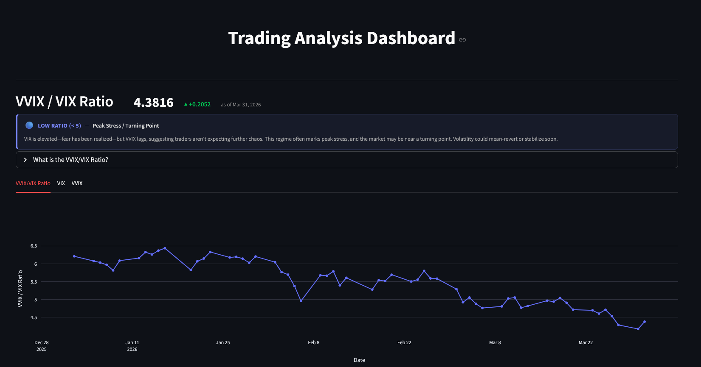
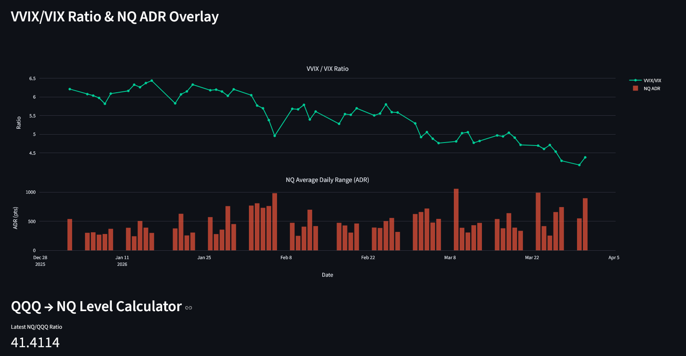

# Trading Helper Pipeline

A daily ETL pipeline that fetches end-of-day OHLCV data for QQQ, NQ futures, VIX, and VVIX from yfinance, stores it in a local DuckDB database, and serves an interactive Streamlit dashboard for pre-market analysis.

Built with [**Bruin**](https://github.com/bruin-data/bruin) for pipeline orchestration.

## Screenshots





## Tracked Symbols

| Symbol | Ticker | Description |
|--------|--------|-------------|
| QQQ | `QQQ` | Invesco QQQ Trust (Nasdaq-100 ETF) |
| NQ | `NQ=F` | E-mini Nasdaq-100 futures |
| VIX | `^VIX` | CBOE Volatility Index |
| VVIX | `^VVIX` | CBOE VIX of VIX |

## Pipeline

Three-layer architecture orchestrated by Bruin:

| Layer | Asset | Strategy | Description |
|-------|-------|----------|-------------|
| Raw | `raw.market_data` | Incremental append | Fetches OHLCV from yfinance; backfills from 2026-01-01 on first run, then only new dates |
| Staging | `staging.validated_data` | Create+replace | Joins all symbols on trade date, validates completeness |
| Mart | `mart.trading_metrics` | Create+replace | Computes NQ/QQQ ratio, VVIX/VIX ratio, and ADR |

```bash
bruin run pipelines/trading_pipeline
```

## Dashboard

Multi-page Streamlit app with three pages:

- **Info** — project overview, symbol descriptions, data loading strategy
- **Dashboard** — VVIX/VIX ratio with regime signal, VIX/VVIX charts, NQ ADR overlay, QQQ→NQ level calculator
- **Data Tables** — historical OHLCV and computed metrics

```bash
streamlit run app/dashboard.py
```

## Project Structure

```
├── .bruin.yml                  # Bruin config (DuckDB connection)
├── requirements.txt            # Python dependencies
├── app/
│   ├── dashboard.py            # Streamlit entry point (page router)
│   └── pages/
│       ├── 1_Info.py           # Info page
│       ├── 2_Dashboard.py      # Charts, signals, calculator
│       └── 3_Data_Tables.py    # Historical data tables
├── pipelines/trading_pipeline/
│   ├── pipeline.yml            # Pipeline definition
│   └── assets/
│       ├── raw/market_data.py          # yfinance fetch (incremental)
│       ├── staging/sync_check.py       # Validation & join
│       └── mart/trading_metrics.sql    # Ratios & ADR
├── data/
│   └── trading.duckdb          # Local DuckDB database
├── tests/
│   ├── test_calculator.py      # QQQ→NQ calculator tests
│   ├── test_data_validation.py # Staging validation tests
│   └── test_transform.py       # Ratio & ADR computation tests
└── docs/
    ├── prd_trading_pipeline.md
    ├── implementation_plan.md
    └── project_idea.md
```

## Setup

```bash
python -m venv .venv
.venv\Scripts\activate        # Windows
pip install -r requirements.txt
```

## Tests

```bash
pytest tests/
```
